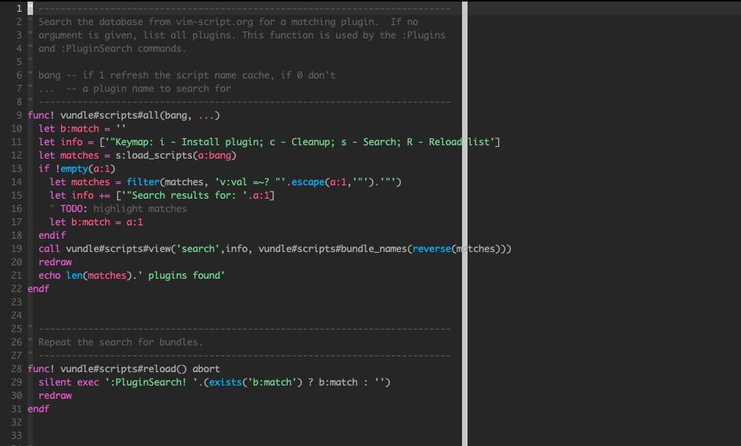

# My dotfiles

## Install

Install homebrew
Clone this project at your home directory and run:

```shell
~/dotfiles/bin/dotfiles
```

> I you don't like to clone source in your home directory feel free to clone it and make this in your way. 

## Vim Color Schemes

### Onedark

